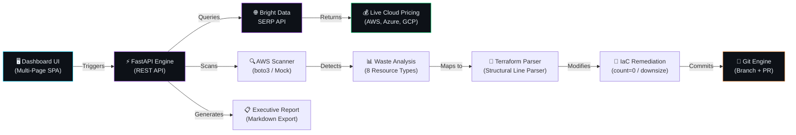

<p align="center">
  
  
  
  
  
</p>

<h1 align="center">⚡ Cloud Waste Sniper</h1>
<h3 align="center">AI-Powered FinOps Platform — Detect, Compare, Remediate Cloud Waste Automatically</h3>
<p align="center"><em>Built for the <strong>Web Data UNLOCKED</strong> Hackathon by lablab.ai × Bright Data</em></p>

---

## 🎯 What Is Cloud Waste Sniper?

**Cloud Waste Sniper** is an enterprise-grade FinOps platform that autonomously detects wasteful cloud infrastructure, scrapes real-time multi-cloud pricing via **Bright Data**, and auto-remediates Terraform configurations — committing optimizations directly via Git.

> **The Problem:** Enterprises lose **$100B+ annually** on idle, unattached, and over-provisioned cloud resources. Manual FinOps audits are slow, expensive, and error-prone.
>
> **Our Solution:** A fully automated pipeline that scans → prices → compares → patches → commits in seconds, not weeks.

---

## 🏗️ Architecture Pipeline



---

## ✨ Key Features

| Feature | Description |
|:---|:---|
| **🔍 Multi-Resource Scanning** | Detects 6 types of waste: EBS Volumes, EC2 Instances, Snapshots, Elastic IPs, NAT Gateways, Load Balancers |
| **🌐 Live Price Scraping** | Uses Bright Data SERP API to fetch real-time AWS, Azure, and GCP retail pricing |
| **📊 Multi-Cloud Price Intelligence** | Side-by-side compute & storage cost comparison across 3 major providers |
| **🔧 Auto-Remediation via IaC** | Directly modifies Terraform files: `count = 0` for removal, instance downsizing for compute |
| **🔀 Git-Backed Audit Trail** | Every remediation creates a Git branch + commit — full audit trail |
| **📋 Executive Reports** | One-click downloadable Markdown reports with category breakdowns |
| **📈 Interactive Dashboards** | Chart.js visualizations: Doughnut, Horizontal Bar, 12-month Savings Projection |
| **🕰️ Scan History** | Complete audit log of all infrastructure scans with timestamps |
| **⚙️ Settings Panel** | Real-time view of API connections, modes, and system configuration |

---

## 🌐 Bright Data Integration (Hackathon Requirement)

Cloud Waste Sniper uses **Bright Data's SERP API** as its core pricing intelligence engine. Instead of relying on stale, hardcoded pricing assumptions, we query Google search results in real-time through Bright Data's infrastructure.

### How It Works

```
┌─────────────────────────────────────────────────────────────┐
│                    PRICING PIPELINE                         │
│                                                             │
│  1. Scan detects wasteful resource (e.g., t3.2xlarge idle)  │
│  2. BrightDataPricingClient sends SERP query:               │
│     "AWS EC2 t3.2xlarge on-demand price per hour us-east-1" │
│  3. Bright Data's SERP API returns Google search results    │
│  4. Regex parser extracts dollar values from snippets       │
│  5. Sanity-range validation ($0.10–$2.00 for compute)       │
│  6. Live price used for waste calculation & charts          │
│                                                             │
│  Fallback: If API key missing or query fails → uses curated │
│  high-fidelity defaults. Never crashes. Always works.       │
└─────────────────────────────────────────────────────────────┘
```

### SERP Queries Made

| Resource | Google Query via Bright Data |
|:---|:---|
| EBS gp3 Volume | `"AWS EBS gp3 price per GB-month us-east-1 site:aws.amazon.com"` |
| EC2 t3.2xlarge | `"AWS EC2 t3.2xlarge on-demand price per hour us-east-1 site:aws.amazon.com"` |
| Azure D8s v5 | `"Azure Standard D8s v5 on-demand price per hour"` |
| GCP n2-standard-8 | `"GCP n2-standard-8 on-demand price per hour"` |
| AWS gp3 Storage | `"AWS EBS gp3 price per GB month us-east-1"` |

### Why Bright Data?

- **Bypass blocks:** AWS pricing pages use aggressive bot detection. Bright Data's infrastructure handles this transparently.
- **Structured results:** SERP API returns clean JSON with organic results, snippets, and metadata.
- **Multi-cloud coverage:** One API to query pricing across AWS, Azure, and GCP simultaneously.
- **Always fresh:** No caching stale CSV exports — every scan gets live market prices.

---

## 🛠️ Technology Stack

| Layer | Technology | Purpose |
|:---|:---|:---|
| **Backend** | Python 3.10+, FastAPI | REST API engine, async request handling |
| **Web Scraping** | Bright Data SERP API | Real-time cloud pricing intelligence |
| **Cloud SDK** | boto3 | AWS resource scanning (read-only) |
| **IaC Engine** | Custom Terraform Parser | Structural line-by-line `.tf` file modification with brace-depth tracking |
| **Version Control** | Git + PyGithub | Automated branch creation, commits, and PR generation |
| **Frontend** | Vanilla HTML/CSS/JS | Premium dark-mode SPA with sidebar navigation |
| **Charts** | Chart.js 4.x (CDN) | Interactive doughnut, bar, and comparison charts |
| **Typography** | Google Fonts (Inter) | Modern, clean UI typography |
| **Reports** | Markdown Generator | Executive-grade downloadable audit reports |

---

## 🚀 Quick Start

### Prerequisites
- Python 3.10+
- Git
- (Optional) Bright Data API key — [Get one free](https://brightdata.com/cp/start)

### Installation

```bash
# Clone the repository
git clone https://github.com/yourusername/cloud-waste-sniper.git
cd cloud-waste-sniper

# Create virtual environment
python -m venv venv
source venv/bin/activate        # Linux/Mac
# venv\Scripts\activate         # Windows

# Install dependencies
pip install -r requirements.txt
```

### Configuration

Copy and edit the `.env` file:

```bash
# .env
MOCK_AWS=true                           # Use mock data (no AWS creds needed)
AWS_REGION=us-east-1

# Bright Data (enables live pricing)
BRIGHTDATA_API_KEY=your_key_here        # From brightdata.com/cp/start
USE_REAL_PRICING=true                   # Toggle live scraping

# Git (optional — enables PR creation)
GITHUB_TOKEN=                           # Leave empty for local-only commits
REPO_PATH=.                             # Path to this repository
```

### Run

```bash
# Start the development server
uvicorn src.main:app --reload --port 8000

# Open in browser
# http://localhost:8000
```

---

## 📸 Application Pages

| Page | Description |
|:---|:---|
| **Dashboard** | KPI cards, 3 interactive charts, findings table with one-click remediation |
| **Price Intelligence** | Multi-cloud compute & storage comparison (AWS vs Azure vs GCP) |
| **Scan History** | Timestamped audit trail of all infrastructure scans |
| **Remediation Log** | Git-backed timeline of all automated changes |
| **Settings** | System configuration panel showing API connection status |

---

## 📁 Project Structure

```
cloud-waste-sniper/
├── src/
│   ├── main.py            # FastAPI application (8 endpoints)
│   ├── scraper.py          # AWS scanner + Bright Data pricing client
│   ├── price_intel.py      # Multi-cloud competitive pricing intelligence
│   ├── mapper.py           # Terraform state mapper + IaC modifier
│   ├── git_engine.py       # Git branch/commit/PR automation
│   ├── reporter.py         # Executive Markdown report generator
│   ├── history.py          # In-memory scan history & audit trail
│   └── templates/
│       └── index.html      # Multi-page SPA dashboard (800+ lines)
├── mock_infra/
│   ├── main.tf             # 8 simulated AWS resources (Terraform)
│   └── terraform.tfstate   # Mock Terraform state file
├── .env                    # Environment configuration
├── requirements.txt        # Python dependencies
└── README.md               # This file
```

---

## 🔗 API Endpoints

| Method | Endpoint | Description |
|:---|:---|:---|
| `GET` | `/` | Dashboard SPA |
| `GET` | `/api/scan` | Run infrastructure waste scan |
| `GET` | `/api/price-intel` | Multi-cloud pricing comparison |
| `GET` | `/api/history` | Scan history audit trail |
| `GET` | `/api/remediation-log` | Remediation activity log |
| `GET` | `/api/settings` | System configuration status |
| `GET` | `/api/report` | Download executive Markdown report |
| `POST` | `/api/remediate` | Execute IaC remediation + Git commit |

---

## 🏆 Hackathon Track Alignment

| Track | Alignment |
|:---|:---|
| **Track 2: Intelligence** | ✅ Multi-cloud competitive pricing intelligence — real-time comparison across AWS, Azure, GCP |
| **Track 3: Infrastructure** | ✅ Self-healing data pipeline — graceful fallbacks, structured outputs, zero-maintenance scraping |

---

## 👥 Team

Built with ⚡ for the Web Data UNLOCKED Hackathon.

---

## 📄 License

MIT License — see [LICENSE](LICENSE) for details.
