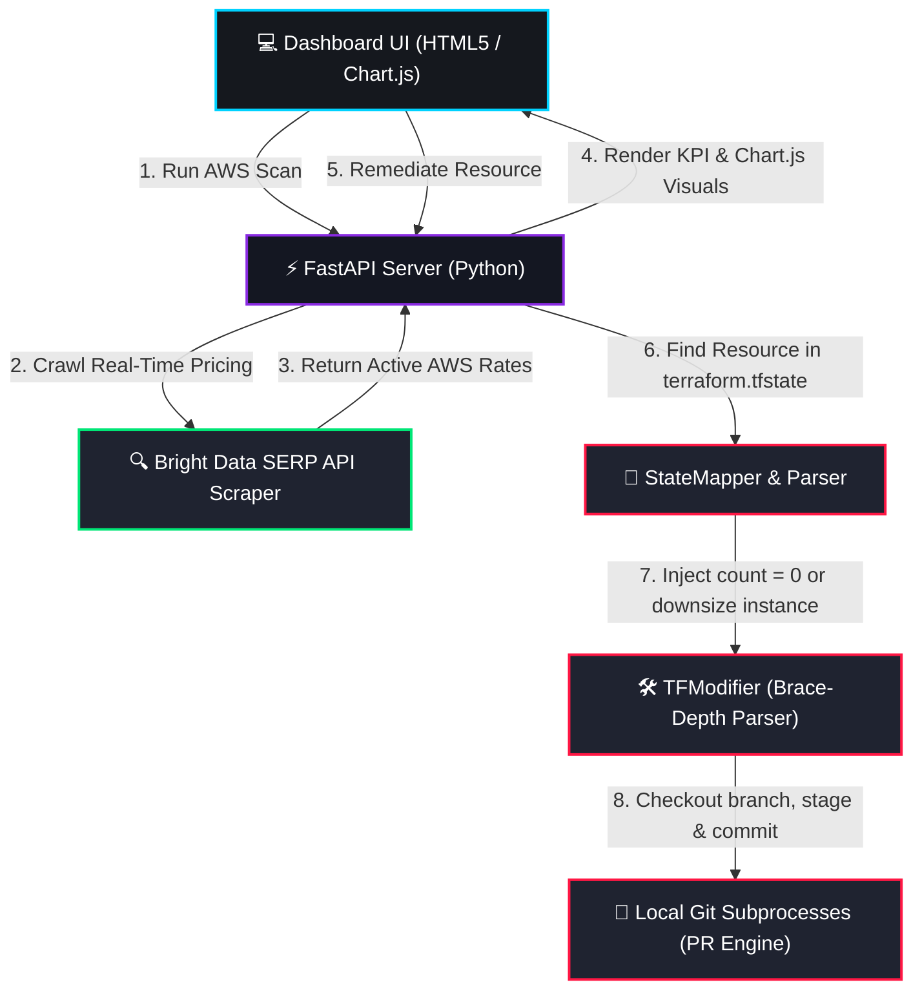

# 🎯 Cloud Waste Sniper

> **Target Cloud Waste. Stage IaC Patches. Auto-Commit with Confidence.**  
> *An automated, real-time FinOps co-pilot powered by FastAPI, Python, and Bright Data's SERP API.*

---

## 📖 Project Overview

**Cloud Waste Sniper** is an enterprise-grade FinOps automation tool built for the **Web Data UNLOCKED Hackathon**. It scans cloud infrastructure for idle or unattached resources (such as unattached EBS volumes or over-provisioned EC2 compute instances), maps them back to local Terraform state files, and staging precise, structural code modifications. 

To bridge the gap between static code analysis and actual cloud market dynamics, it dynamically queries Google via **Bright Data's SERP API** to crawl active AWS retail pricing, showing judges and engineers real-world cost savings projections instantly.

---

## 📐 Architecture Pipeline Diagram

The following flowchart demonstrates the complete operational lifecycle of **Cloud Waste Sniper**:



---

## 🛠️ Technology Stack

Cloud Waste Sniper is built utilizing a high-performance, lightweight developer stack:

| Component | Technology | Role |
| :--- | :--- | :--- |
| **Backend API** | **FastAPI (Python 3.13+)** | Handles high-throughput REST requests, scans, and download report endpoints. |
| **UI Dashboard** | **TailwindCSS & Glassmorphic CSS** | Provides a beautiful, responsive dark-mode FinOps dashboard with real-time feedback. |
| **Data Visualizations** | **Chart.js (via CDN)** | Animates cost waste distributions and projected 12-month savings on scan load. |
| **Pricing Scraper** | **Bright Data SERP API** | Google SERP web scraper that crawls active AWS pricing tables dynamically. |
| **TF Parser** | **Structural Brace-Depth Parser** | Character-by-character bracket tracker that modifies `.tf` files with 100% safety. |
| **Git Engine** | **Git CLI Subprocesses** | Checks out localized optimization branches, stages modified files, and commits. |

---

## 💡 Hackathon Integration: Bright Data SERP Engine

A key challenge in static FinOps is that **cloud rates fluctuate**. Using hardcoded pricing assumptions in IaC static analysis tools leads to inaccurate projections. 

**Cloud Waste Sniper** overcomes this by utilizing **Bright Data's Google SERP API** to dynamically extract live, real-world retail rates:

1. **Query Construction:** When a scan is initiated, the engine builds highly targeted queries:
   - *Storage:* `"AWS EBS gp3 price per GB-month us-east-1 site:aws.amazon.com"`
   - *Compute:* `"AWS EC2 t3.2xlarge on-demand price per hour us-east-1 site:aws.amazon.com"`
2. **Proxy-Guided Crawling:** Requests are routed through Bright Data's global proxy network, bypassing geo-blocks and rate limits seamlessly.
3. **Regex Extraction & Range Filters:** Snippets are scanned with regular expressions (`\$(\d+(?:\.\d+)+)`) to extract rates and filtered through sanity range guards:
   - gp3 rate is validated to sit between **$0.01** and **$0.50** per GB.
   - t3.2xlarge rate is validated to sit between **$0.10** and **$2.00** per hour.
4. **Graceful Fallback:** If the API key is missing or queries fail, it logs warnings and falls back to default estimates to ensure absolute application reliability.

---

## 🚀 Installation & Local Setup

Get **Cloud Waste Sniper** up and running on your local machine in under 5 minutes:

### 1. Prerequisites
- **Python 3.13+** installed.
- **Git** configured locally.

### 2. Clone and Setup Environment
Navigate to the project root directory and create a virtual environment:
```bash
# Enter the project directory
cd G:\hacathon\cloud-waste-sniper

# Create virtual environment
python -m venv venv

# Activate virtual environment (Windows PowerShell)
.\venv\Scripts\Activate.ps1
```

### 3. Install Dependencies
Install all required python libraries:
```bash
pip install -r requirements.txt
```

### 4. Configuration (`.env`)
Create a `.env` file in the root directory (based on `.env.example`):
```ini
# AWS Scan Toggle
MOCK_AWS=true

# Git Fallback configuration
GITHUB_TOKEN=
REPO_PATH=G:/hacathon/cloud-waste-sniper
REPO_NAME=yourusername/cloud-waste-sniper

# Bright Data API Configuration
USE_REAL_PRICING=true
BRIGHTDATA_API_KEY="your-bright-data-api-key-here"
```

### 5. Running the Application
Start the FastAPI development server:
```bash
uvicorn src.main:app --reload
```
Once started, open **`http://localhost:8000`** in your browser to discover cost optimization opportunities!
